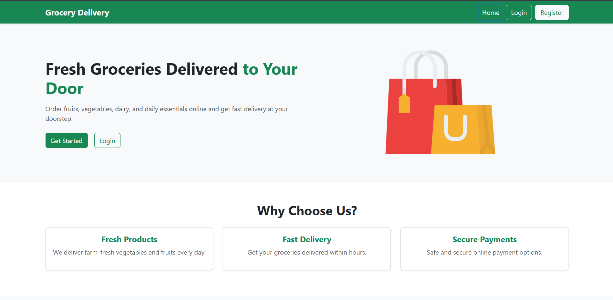
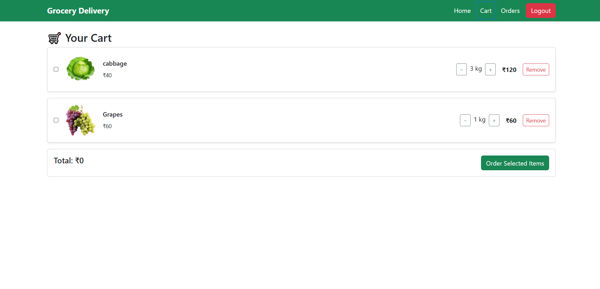
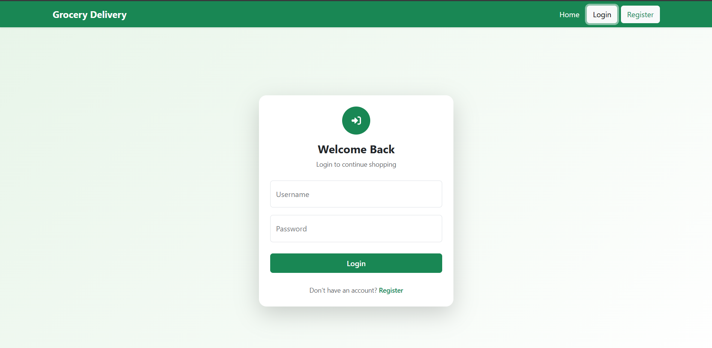
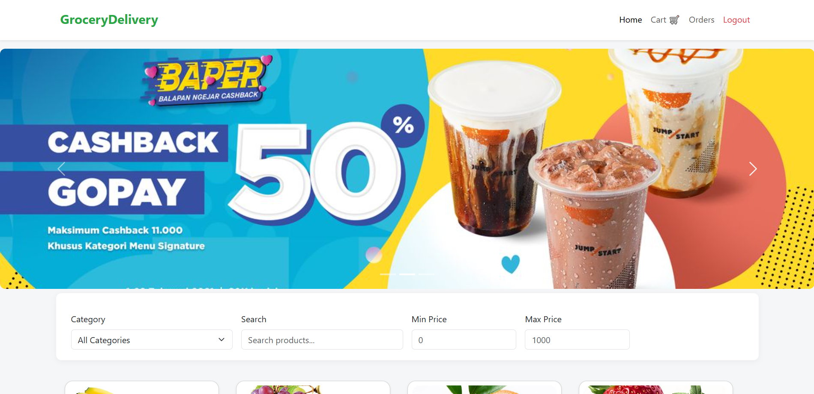

# Grocery Delivery 🛒

[](https://www.python.org/)
[](https://www.djangoproject.com/)
[](https://opensource.org/licenses/MIT)

A full-stack **grocery delivery web app** built with **Django REST Framework** backend and **HTML, Bootstrap 5, and JavaScript** frontend. Users can browse products, manage their cart, and place orders online.

---

## 🚀 Features

- User authentication (Login / Logout)
- Browse products with categories, search, and price filters
- Add products to cart and update quantities
- Place orders with delivery details
- Dynamic carousel for promotional banners
- Fully responsive UI

---

## 🎨 Screenshots 

  
  

  

---

## 🛠 Tech Stack

**Backend:** Python, Django, Django REST Framework  
**Frontend:** HTML5, CSS3, Bootstrap 5, JavaScript  
**Database:** SQLite / PostgreSQL / MySQL (configurable)  

---

## ⚡ Quick Start

```bash
# Clone repository
git clone <https://github.com/vivekm98/grocery_delivary_plathform>


# Create virtual environment
python -m venv venv
source venv/bin/activate  # Linux/Mac
venv\Scripts\activate     # Windows


# Install dependencies
pip install -r requirements.txt
create derictory media
grocery_delivary_plathform/
   media/
        |posters
        |prducts
        |category
cd grocery-delivery/backend

# Configure database in settings.py

# Run migrations
python manage.py makemigrations
python manage.py migrate

# Create superuser (optional)
python manage.py createsuperuser

# Start server
python manage.py runserver
````

Then open `frontend/home.html` in your browser.

---

## 🔗 API Endpoints

| Endpoint          | Method       | Description                |
| ----------------- | ------------ | -------------------------- |
| `/api/products/`  | GET          | List all products          |
| `/api/cart/`      | GET/POST     | View / add items to cart   |
| `/api/cart/<id>/` | PATCH/DELETE | Update or remove cart item |
| `/api/orders/`    | POST         | Place an order             |
| `/api/posters/`   | GET          | Get carousel banners       |

---


## ✉️ Contact
  Name – Vivek Ramesh More
  Email - vivekmore45678@gmail.com
  GitHub: https://github.com/vivekm98/

```


