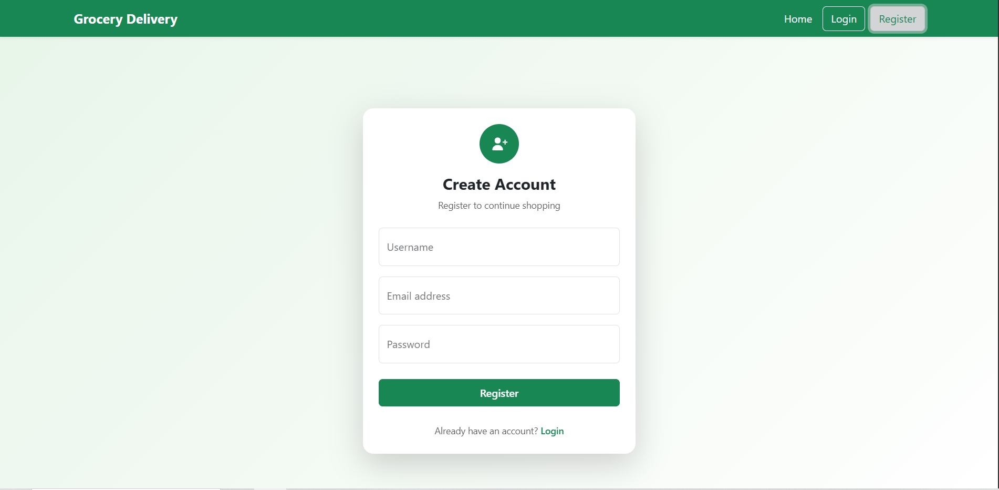
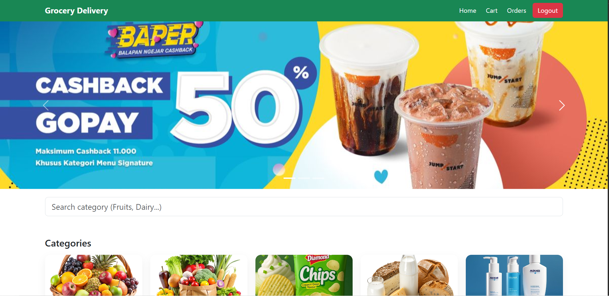
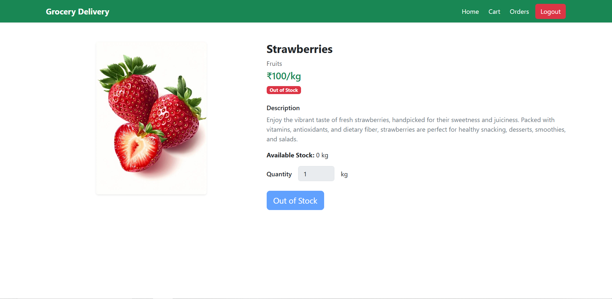

# Grocery Delivery Platform

A full-stack **Grocery Delivery Web Application** built with **React** (frontend) and **Django REST Framework** (backend).  
Allows users to browse categories and products, add items to cart, place orders, and view order history.

---

## 🔹 Features

- User registration & authentication
- Browse products by category
- Search products and categories
- Add products to cart with quantity selection
- Place orders & view order history
- Track order status (Pending, Processing, Shipped, Delivered, Cancelled)
- Admin can manage products, categories, and orders (if backend admin panel is used)

---

## 🔹 Tech Stack

- **Frontend:** React, Bootstrap, Axios, React Router  
- **Backend:** Django, Django REST Framework  
- **Database:** SQLite / PostgreSQL (depending on setup)  
- **Authentication:** JWT (JSON Web Tokens)  

---

## 🔹 Project Structure

```

grocery_delivery_platform/
├── backend/             # Django REST Framework backend
│   ├── api/             # API endpoints
│   ├── products/        # Product models and serializers
│   ├── users/           # User models and auth
│   └── manage.py
├── frontend/            # React frontend
│   ├── src/
│   │   ├── components/  # React components
│   │   ├── pages/       # Page views
│   │   └── axiosInstance.js
│   └── package.json
├── README.md            # This file
└── .gitignore

````

---

## 🔹 Installation

### **1. Backend (Django REST API)**

```bash
# Clone the repo
git clone https://github.com/vivekm98/grocery_delivary_plathform_.git
cd grocery_delivary_plathform_/backend

# Create virtual environment
python -m venv env
source env/bin/activate      # Linux/Mac
env\Scripts\activate         # Windows

# Install dependencies
pip install -r requirements.txt

# Create .env file
# Example:
# SECRET_KEY=your_django_secret
# DEBUG=True
# DATABASE_URL=sqlite:///db.sqlite3

# Apply migrations
python manage.py makemigrations
python manage.py migrate

# Create superuser (optional)
python manage.py createsuperuser

# Run server
python manage.py runserver
````

### **2. Frontend (React)**

```bash
cd ../frontend

# Install dependencies
npm install

# Create .env file
# Example:
# VITE_BACKEND_BASE_API=http://127.0.0.1:8000/api/v1
# VITE_BACKEND_ROOT=http://127.0.0.1:8000

# Run React development server
npm run dev
```

---

## 🔹 Usage

1. Open frontend URL (usually `http://localhost:5173/`)
2. Browse categories and products
3. Add items to cart and place orders
4. View order history

---

## 🔹 Screenshots

*(Replace with your screenshots)*

* **Home**
  

* **Register**
  

* **Login**
  

* **Categories**
  
  
* **Dashboard**
  

* **Product Detail**
  

* **Cart & Checkout**
  

---

## 🔹 Contributing

1. Fork the repository
2. Create a new branch: `git checkout -b feature/your-feature`
3. Commit changes: `git commit -m "Add some feature"`
4. Push to branch: `git push origin feature/your-feature`
5. Create a Pull Request

---

## 🔹 License

MIT License © 2026 [Vivek Ramesh More]
Email - vivekmore45678@gmail.com

```

